# JS-Keypad

13-Tasten-Keypad (4 Finger × 3 Reihen + Daumentaste unter dem Stick) mit Daumen-Stick für die linke Hand – Firmware für den
Pro Micro und ein Web-Mapper, in dem man auf ein Abbild des Keypads klickt und die Taste belegt.

**Mapper:** https://moisschen.github.io/js-keypad/ (Chrome oder Edge, Web Serial)

## Funktionen

- Klickbares Abbild: Taste anklicken (oder am Keypad drücken) → gewünschte Taste auf der PC-Tastatur
  drücken oder aus der Liste wählen. Wird sofort auf dem Keypad gespeichert.
- Belegungen sind HID-Tastencodes – gleiche physische Taste auf jedem Tastaturlayout (QWERTZ, AZERTY …),
  die Beschriftung im Mapper folgt dem Layout des PCs.
- Stick als Tastatur (Standard W/A/S/D + Shift), Controller oder Maus; Kalibrierung, Stickwinkel.
- Tastentest, Verdrahtungs-Check, Sichern/Laden der Einstellungen.
- Verdrahtung anlernen: Tasten in beliebiger Reihenfolge an die freien Pins löten, dann im Mapper jede
  markierte Taste einmal drücken – die Zuordnung wird auf dem Keypad gespeichert.
- Ohne angeschlossenen Stick „Stick angeschlossen“ abhaken, sonst lösen die offenen Eingänge Richtungstasten aus.
- Firmware direkt aus dem Browser aufspielen (auch auf einen neuen Pro Micro).

## Verdrahtung



Jede Taste zwischen Pin und GND, keine Dioden/Matrix (`INPUT_PULLUP`):

|        | Zeige | Mittel | Ring | Klein |
|--------|-------|--------|------|-------|
| oben   | 0     | 1      | 3    | 4     |
| Mitte  | 5     | 6      | 7    | 8     |
| unten  | 9     | 10     | A2   | A3    |

Daumentaste (unter dem Stick): Pin 15.

Die Tabelle ist die Standard-Verdrahtung. Der Plan oben zeigt die tatsächlich gelötete (angelernte) Zuordnung und den
Pro Micro **von unten**, weil er kopfüber im Gehäuse liegt – so sieht man ihn beim Löten. Tasten in anderer
Reihenfolge angeschlossen? Im Mapper „Verdrahtung anlernen“.

Stick (PS5-Hall-Stick): Y → A1, X → A0, Switch → 14 (oder 16), **beide** GND und **beide** VCC anschließen.
Läuft eine Richtung verkehrt herum, im Mapper umkehren. Pin 2 = LED (optional).
Auf der Platine heißt Pin 0 **RXI** und Pin 1 **TXO**. Der Plan wird mit `python tools/make_wiring.py` erzeugt
(Zuordnung oben in der Datei: `KEY_PINS`).

## Rettung

Stick-Klick beim Einstecken **3 Sekunden halten** → Bootloader, dann im Mapper „2. Firmware aufspielen“.
Kurz klicken beim Einstecken schaltet den Stick-Modus weiter; Stick beim Einstecken hoch/rechts/runter
halten wählt Tastatur/Controller/Maus direkt.

## Bauen

```bash
./build.sh
```

Braucht `arduino-cli` mit `arduino:avr`. Baut `firmware/js_keypad`, kopiert das Hex nach `docs/` und
schreibt die Version nach `docs/firmware-version.txt`. Vor jedem Release `FirmwareVersion` in
`js_keypad.ino` hochzählen und `docs/` mit committen – GitHub Pages liefert den Mapper aus `docs/`.
